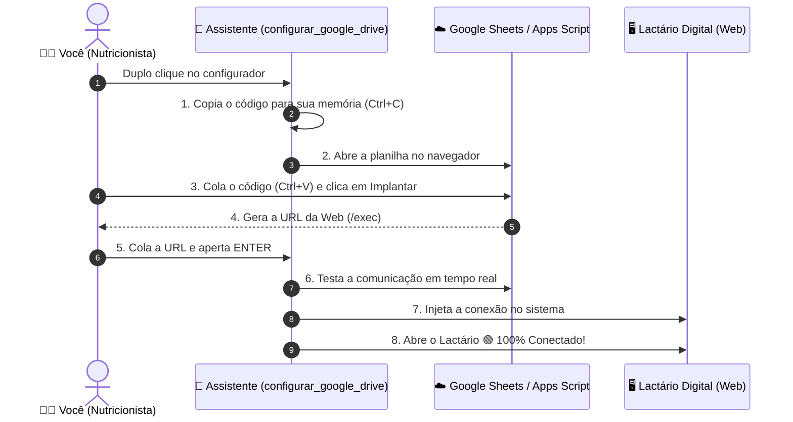

# 📘 Manual de Implementação na Suíte Google (Passo a Passo Automatizado)
### Lactário Digital • Hospital São Paulo (UNIFESP-EPM) / NutriLac

Este manual detalha o processo completo para conectar a aplicação **Lactário Digital (NutriLac)** à sua planilha oficial no Google Drive / Google Sheets utilizando o assistente automatizado **`configurar_google_drive`**.

---

## 🧭 Visão Geral do Fluxo

---

## 🟢 ETAPA 1: Executar o Assistente Automático

1. Abra a pasta **`NutriLac`** no seu computador.
2. Dê um **duplo clique** no arquivo de acordo com o seu sistema operacional:
   - Se você estiver no **Mac:** dê duplo clique em **`configurar_google_drive.command`**
   - Se você estiver no **Windows:** dê duplo clique em **`configurar_google_drive.bat`**
3. Uma tela preta estilizada do assistente se abrirá:
   - Você verá a mensagem verde: `✅ O código do Apps Script foi copiado automaticamente para a sua Área de Transferência!`
4. Pressione a tecla **ENTER** no teclado.
5. O assistente **abrirá uma nova planilha do Google Sheets no seu navegador** automaticamente.

---

## ☁️ ETAPA 2: Colar o Código e Implantar no Google (30 segundos)

Na página do Google Sheets que acabou de abrir no seu navegador:

1. **Renomeie a Planilha (Opcional):**
   - No canto superior esquerdo (onde diz *Planilha sem título*), mude o nome para:
     `Lactário HSP - Banco de Dados Oficial`

2. **Abrir o Editor de Código:**
   - No menu superior da planilha, clique em: **Extensões** ➔ **Apps Script**.
   - Uma nova aba do navegador se abrirá com o editor de código.

3. **Colar o Código:**
   - Se houver algum texto de exemplo no editor (ex: `function myFunction() {}`), selecione tudo e **apague**.
   - Pressione **Ctrl + V** (ou **Cmd + V** no Mac) para colar o código *(o assistente já copiou o código para você no início!)*.
   - Pressione **Ctrl + S** (ou **Cmd + S**) para **Salvar**.

4. **Publicar como Aplicativo da Web:**
   - No canto superior direito, clique no botão azul **Implantar** (*Deploy*) ➔ **Nova implantação** (*New deployment*).
   - Ao lado de *Selecione o tipo*, clique no ícone da **engrenagem ⚙️** e escolha: **Aplicativo da Web** (*Web app*).
   - Configure os campos exatamente assim:
     - **Descrição:** `API Lactário HSP`
     - **Executar como:** `Eu (seu-email@...)`
     - **Quem pode acessar:** Escolha obrigatoriamente **Qualquer pessoa** (*Anyone*).
   - Clique no botão azul **Implantar**.

5. **Liberar a Permissão do Google (OAuth):**
   - Clique em **Autorizar acesso** (ou *Revisar permissões*).
   - Escolha a sua conta Google.
   - Na tela *O Google não verificou este app*, clique na palavra **Avançado** (*Advanced*, no canto inferior esquerdo).
   - Clique em **Acessar API Lactário HSP (não seguro)**.
   - Role até o final e clique em **Permitir** (*Allow*).

6. **Copiar o Link Gerado:**
   - O Google exibirá a tela de conclusão com a **URL do aplicativo da Web** (um link comprido terminando em `/exec`).
   - Clique no botão **Copiar**.

---

## ⚡ ETAPA 3: Finalização Automática pelo Assistente

1. Volte para a janela do assistente no seu computador.
2. O assistente estará aguardando com a mensagem:
   `👉 Cole a URL da Web App gerada aqui e pressione [ENTER]:`
3. Pressione **Ctrl + V** (ou **Cmd + V**) para colar o link copiado e aperte **ENTER**.
4. **O Assistente fará o resto sozinho:**
   - 🔍 Fará o teste de comunicação HTTP com o Google Drive em tempo real.
   - 🎉 Exibirá: `🎉 SUCESSO! A planilha respondeu perfeitamente!`
   - 💾 Gravará e injetará a URL diretamente dentro da aplicação web.
5. Pressione **ENTER** uma última vez.
6. O navegador abrirá o **Lactário Digital**, que já estará **100% conectado com o selo verde 🟢 Google Sheets Conectado**.

---

## 📁 ETAPA 4: Ativar o Modo Offline no Google Drive Desktop (Contingência)

Para garantir que a equipe do lactário tenha acesso 100% ininterrupto mesmo em dias de oscilação ou queda de internet:

1. Abra a pasta do **Google Drive** no Windows Explorer ou Mac Finder.
2. Arraste a pasta **`NutriLac`** para dentro do seu Google Drive.
3. Clique com o **botão direito do mouse** na pasta `NutriLac`.
4. Escolha: **Acesso off-line** ➔ **Disponível off-line** (ou **Tornar disponível off-line**).
5. O ícone de visto verde (✔) confirmará que os arquivos estão salvos no disco rígido físico da máquina.

---

## ❓ Perguntas Frequentes (FAQ)

| Dúvida | Resposta |
| :--- | :--- |
| **Preciso fazer login no Google todo dia ao ligar o computador?** | **Não.** Uma vez configurada a URL, o sistema fica conectado permanentemente sem exigir senhas ou logins nos turnos seguintes. |
| **Se mover ou copiar a pasta `NutriLac` para outro computador, precisa reconfigurar?** | **Não.** A pasta já leva a chave de conexão gravada em `js/config.js`. Basta abrir o `index.html` em qualquer máquina. |
| **O que acontece se a internet do hospital cair?** | O sistema continua funcionando normalmente. Todos os cadastros, altas e edições são salvos localmente no navegador e sincronizados com o Google assim que a internet voltar. |
| **Outro nutricionista precisa autorizar algo na conta dele?** | **Não.** Como configuramos *Quem pode acessar: Qualquer pessoa*, qualquer profissional com a pasta ou o link tem acesso imediato à planilha central. |
